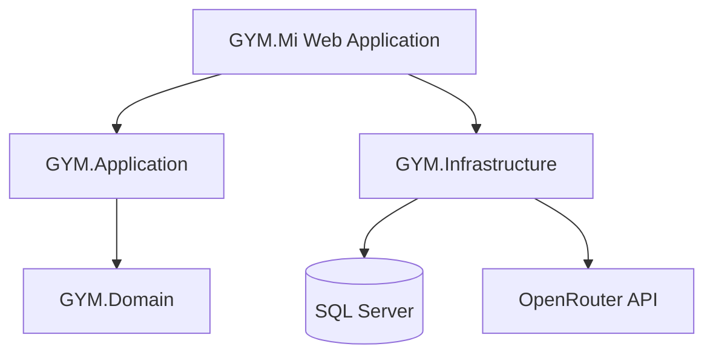

# Gym Management System with Smart Fitness Coach

A web-based **Gym Management System** built with **ASP.NET Core MVC**, **.NET 9**, **Entity Framework Core**, and **SQL Server**.

This project helps manage gym members, trainers, employees, memberships, equipment, pending payments, blogs, and role-based administration from one platform. It also includes a **Smart AI Fitness Coach** integrated with **OpenRouter API** for personalized workout, nutrition, recovery, and safety-related fitness guidance.

---

## Project at a Glance

| Item | Details |
|---|---|
| Project Type | Web-based Gym Management System |
| Framework | ASP.NET Core MVC / .NET 9 |
| Language | C# |
| Database | SQL Server |
| ORM | Entity Framework Core |
| Frontend | HTML, CSS, Bootstrap, JavaScript |
| AI Integration | OpenRouter API |
| Status | Core features completed and ready for demonstration |

---

## Key Features

| Module | Features |
|---|---|
| Admin & Management | Dashboard, user management, employee management, trainer management, equipment management, blog management |
| Membership & Payment | Membership tracking, active/pending/expired status, pending cash payment approval, membership history |
| Trainer & Member | Dedicated member profile, trainer assignment, assigned student management, fitness and health information |
| AI Fitness Coach | Workout guidance, food advice, recovery suggestions, safety-aware fitness recommendations |
| Security & Configuration | Local `appsettings.json`, protected API key and connection string setup |

---

## Project Architecture



The project follows a layered structure to keep the application organized and maintainable.

```text
GYM.Mi.Web
├── GYM.Mi
│   ├── GYM.Application
│   ├── GYM.Domain
│   ├── GYM.Infrastructure
│   ├── GYM.Mi
│   └── GYM.Mi.sln
├── screenshots
└── README.md
```

### Layer Overview

| Layer | Purpose |
|---|---|
| `GYM.Domain` | Contains domain models and core entities |
| `GYM.Application` | Contains application services and business logic |
| `GYM.Infrastructure` | Handles data access, database implementation, and external service integration |
| `GYM.Mi` | Main ASP.NET Core MVC web application with controllers, views, and UI logic |

---

## Main Screenshots

### Landing Page

<p align="center">
  
</p>

### Admin Dashboard

<p align="center">
  
</p>

### Member Profile

<p align="center">
  
</p>

### Smart AI Fitness Coach

<p align="center">
  
</p>

---

<details>
<summary><strong>View More Screenshots</strong></summary>

### User Management

<p align="center">
  
</p>

### Pending Payments

<p align="center">
  
</p>

### Equipment Management

<p align="center">
  
</p>

### Trainer Assignment

<p align="center">
  
</p>

</details>

---

## How to Run Locally

<details open>
<summary><strong>Local Setup Instructions</strong></summary>

### Prerequisites

Make sure the following tools are installed:

- Visual Studio
- .NET 9 SDK
- SQL Server
- SQL Server Management Studio
- Git

### Run Steps

1. Clone the repository:

```bash
git clone https://github.com/Kaoser-6139/GYM.Mi.Web.git
```

2. Open the solution file in Visual Studio:

```text
GYM.Mi/GYM.Mi.sln
```

3. Set the main MVC project as the startup project:

```text
GYM.Mi
```

4. Restore NuGet packages.

5. Create a local `appsettings.json` file inside the main web project:

```text
GYM.Mi/GYM.Mi/appsettings.json
```

6. Configure the SQL Server connection string and OpenRouter API credentials.

7. Open **Package Manager Console** in Visual Studio.

8. Run the following command:

```powershell
Update-Database
```

9. Run the application from Visual Studio.

10. Login using the demo admin credential.

</details>

---

## Configuration

<details>
<summary><strong>appsettings.json Example</strong></summary>

For security reasons, `appsettings.json` is not included in this repository.

Create your own `appsettings.json` file locally and configure the connection string and OpenRouter credentials.

```json
{
  "ConnectionStrings": {
    "DefaultConnection": "Server=YOUR_SERVER_NAME;Database=GymManagementDb;Trusted_Connection=True;TrustServerCertificate=True;"
  },
  "OpenRouter": {
    "ApiKey": "YOUR_OPENROUTER_API_KEY",
    "ModelId": "YOUR_MODEL_ID",
    "BaseUrl": "YOUR_OPENROUTER_BASE_URL"
  }
}
```

Replace the placeholder values with your own local configuration.

</details>

---

## Database Setup

This project uses **Entity Framework Core migrations**.

After configuring the SQL Server connection string, run:

```powershell
Update-Database
```

This will create or update the SQL Server database using the existing migrations.

---

## Demo Login Credentials

The following credential is for **local demo/testing purposes only**.

```text
Admin Email: admin@gmail.com
Password: 123456789
```

Do not use these credentials for production or live deployment.

---

## AI Fitness Coach Integration

The **Smart AI Fitness Coach** is integrated using **OpenRouter API**.

It can provide general fitness guidance such as:

- Workout plan suggestions
- Food advice
- Recovery guidance
- Exercise technique support
- Safety-aware recommendations based on health information

The API key is not included in this repository. Developers must add their own OpenRouter API key in the local `appsettings.json` file.

---

## Project Status

**Core features completed and ready for demonstration.**

---

## Author

**Md. Imrul Kaoser**  
ASP.NET Core Intern | Junior .NET Developer | C# | SQL Server

- GitHub: [Kaoser-6139](https://github.com/Kaoser-6139)
