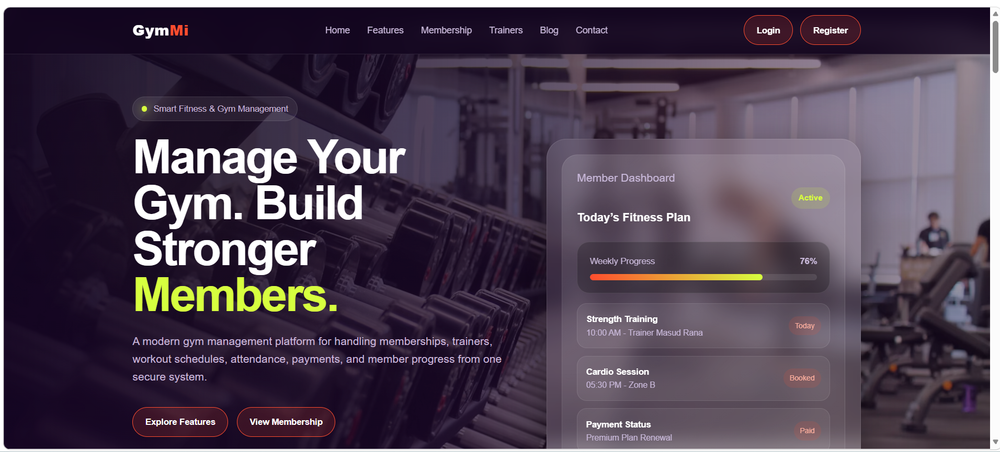
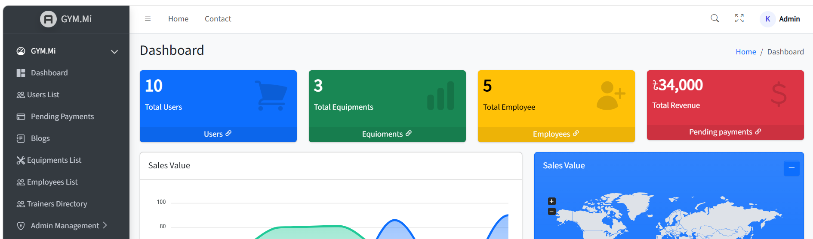
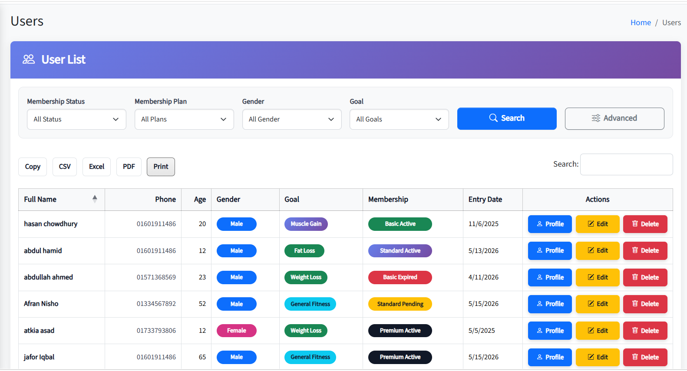
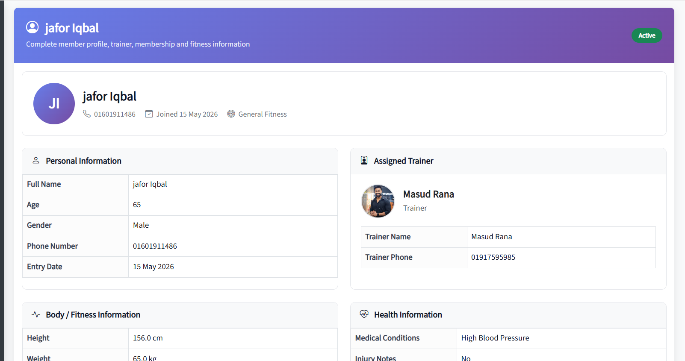
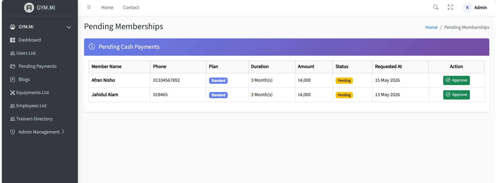
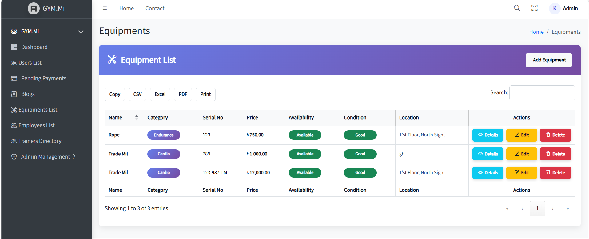
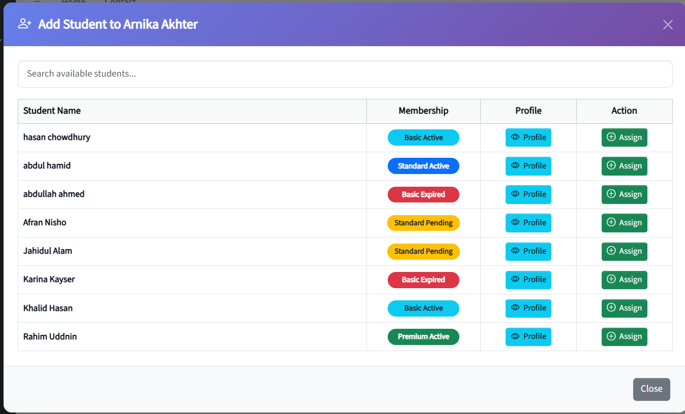
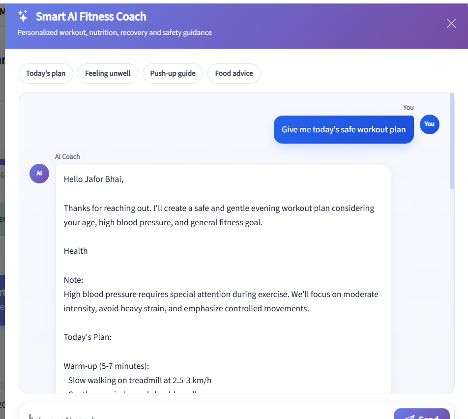

# Gym Management System with Smart Fitness Coach

A web-based Gym Management System built with **ASP.NET Core MVC**, **.NET 9**, and **SQL Server**.

The system is designed to manage gym members, trainers, employees, memberships, equipment, pending payments, blogs, and role-based administration from a single platform.

It also includes a **Smart AI Fitness Coach** integrated with **OpenRouter API** to provide personalized workout, nutrition, recovery, and safety-related fitness guidance based on member profile information.

---

<a id="quick-navigation"></a>

## Quick Navigation

<p align="center">
  <a href="#key-features">
    
  </a>
  <a href="#technology-stack">
    
  </a>
  <a href="#project-architecture">
    
  </a>
  <a href="#screenshots">
    
  </a>
  <a href="#how-to-run-locally">
    
  </a>
  <a href="#configuration">
    
  </a>
  <a href="#database-setup">
    
  </a>
  <a href="#demo-login-credentials">
    
  </a>
  <a href="#ai-fitness-coach-integration">
    
  </a>
  <a href="#project-status">
    
  </a>
  <a href="#author">
    
  </a>
</p>

---

## Key Features

### Admin & Management
- Admin dashboard with summary cards
- User/member management
- Employee management
- Trainer management
- Equipment management
- Blog management
- Role-based user management

### Membership & Payment
- Membership plan tracking
- Active, pending, and expired membership status
- Pending cash payment approval
- Membership history tracking

### Trainer & Member Features
- Dedicated member profile
- Trainer assignment
- Assigned student management for trainers
- Member fitness, health, trainer, and membership information display

### Smart AI Fitness Coach
- AI-powered fitness assistant using OpenRouter API
- Personalized workout guidance
- Food and recovery suggestions
- Safety-aware fitness advice based on health notes
- Supports user queries related to workout plans, exercise guidance, and fitness improvement

<p align="right">
  <a href="#quick-navigation">
    
  </a>
</p>

---

## Technology Stack

- **Language:** C#
- **Framework:** ASP.NET Core MVC / .NET 9
- **Database:** SQL Server
- **ORM:** Entity Framework Core
- **Frontend:** HTML, CSS, Bootstrap, JavaScript
- **AI Integration:** OpenRouter API
- **IDE:** Visual Studio
- **Version Control:** Git & GitHub

<p align="right">
  <a href="#quick-navigation">
    
  </a>
</p>

---

## Project Architecture

The project follows a layered structure to separate concerns and keep the application organized.

```text
GYM.Mi.Web
├── GYM.Mi
│   ├── GYM.Application
│   ├── GYM.Domain
│   ├── GYM.Infrastructure
│   ├── GYM.Mi
│   └── GYM.Mi.sln
├── screenshots
└── README.md
```

### Layer Overview

- **GYM.Domain**  
  Contains domain models and core entities.

- **GYM.Application**  
  Contains application services and business logic.

- **GYM.Infrastructure**  
  Handles data access, database-related implementation, and external service integration.

- **GYM.Mi**  
  Main ASP.NET Core MVC web application containing controllers, views, and UI-related logic.

<p align="right">
  <a href="#quick-navigation">
    
  </a>
</p>

---

## Screenshots

Since the project is not currently deployed live, screenshots are included to demonstrate the working interface and major features of the system.

### Landing Page


### Admin Dashboard


<details>
<summary><strong>View All Screenshots</strong></summary>

### Landing Page


### Admin Dashboard


### User Management


### Member Profile


### Pending Payments


### Equipment Management


### Trainer Assignment


### Smart AI Fitness Coach


</details>

<p align="right">
  <a href="#quick-navigation">
    
  </a>
</p>

---

## How to Run Locally

### Prerequisites

Make sure the following tools are installed on your machine:

- Visual Studio
- .NET 9 SDK
- SQL Server
- SQL Server Management Studio
- Git

---

### Run Steps

1. Clone the repository:

```bash
git clone https://github.com/Kaoser-6139/GYM.Mi.Web.git
```

2. Open the solution file in Visual Studio:

```text
GYM.Mi/GYM.Mi.sln
```

3. Set the main MVC project as the startup project:

```text
GYM.Mi
```

4. Restore NuGet packages.

5. Create a local `appsettings.json` file inside the main web project:

```text
GYM.Mi/GYM.Mi/appsettings.json
```

6. Configure the SQL Server connection string and OpenRouter API credentials.

7. Open **Package Manager Console** in Visual Studio.

8. Run the following command:

```powershell
Update-Database
```

9. Run the application from Visual Studio.

10. Login using the demo admin credential.

<p align="right">
  <a href="#quick-navigation">
    
  </a>
</p>

---

## Configuration

For security reasons, `appsettings.json` is not included in this repository.

You need to create your own `appsettings.json` file locally before running the project.

### Example `appsettings.json`

```json
{
  "ConnectionStrings": {
    "DefaultConnection": "Server=YOUR_SERVER_NAME;Database=GymManagementDb;Trusted_Connection=True;TrustServerCertificate=True;"
  },
  "OpenRouter": {
    "ApiKey": "YOUR_OPENROUTER_API_KEY",
    "ModelId": "YOUR_MODEL_ID",
    "BaseUrl": "YOUR_OPENROUTER_BASE_URL"
  }
}
```

Replace the placeholder values with your own local configuration.

<p align="right">
  <a href="#quick-navigation">
    
  </a>
</p>

---

## Database Setup

This project uses **Entity Framework Core migrations**.

After configuring the SQL Server connection string, run the following command from **Package Manager Console**:

```powershell
Update-Database
```

This will create or update the SQL Server database using the existing migrations.

<p align="right">
  <a href="#quick-navigation">
    
  </a>
</p>

---

## Demo Login Credentials

The following credential is for local demo/testing purposes only.

```text
Admin Email: admin@gmail.com
Password: 123456789
```

Do not use these credentials for production or live deployment.

<p align="right">
  <a href="#quick-navigation">
    
  </a>
</p>

---

## AI Fitness Coach Integration

The Smart AI Fitness Coach is integrated using **OpenRouter API**.

The AI coach can provide general fitness guidance such as:

- Workout plan suggestions
- Food advice
- Recovery guidance
- Exercise technique support
- Safety-aware recommendations based on health information

The API key is not included in this repository. Developers must add their own OpenRouter API key in the local `appsettings.json` file.

<p align="right">
  <a href="#quick-navigation">
    
  </a>
</p>

---

## Project Status

**Core features completed and ready for demonstration.**

<p align="right">
  <a href="#quick-navigation">
    
  </a>
</p>

---

## Author

**Md. Imrul Kaoser**  
ASP.NET Core Intern | Junior .NET Developer | C# | SQL Server

- GitHub: [Kaoser-6139](https://github.com/Kaoser-6139)

<p align="right">
  <a href="#quick-navigation">
    
  </a>
</p>
